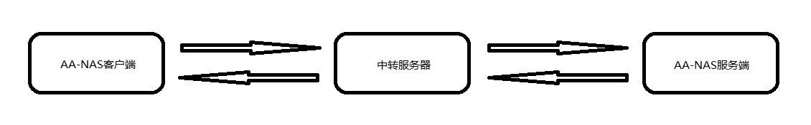

# AA-NAS Client

### 介绍
1. 这是一款Electron框架开发的桌面端软件，用于电脑与电脑之间传输文件，设计的初衷是为了将个人闲置的旧电脑利用起来，在旧电脑中安装AA-NAS服务端软件，
在常用的电脑中安装AA-NAS客户端软件，可实现将旧电脑作为文件服务器使用，在客户端和服务器之间传输文件。
2. 如果有多台旧电脑，可在每台旧电脑中都安装AA-NAS服务端软件，客户端支持切换服务端，实现多台旧电脑作为文件服务器使用。
3. 由于使用了Electron框架，并且代码中的api都做了兼容性处理，所以理论上客户端软件支持4.Windows、Linux和MacOS系统，只需要打包成对应系统的安装包即可。
4. 目前只在windows系统上测试过。

### 软件架构


由于要实现外网访问，提供了测试使用的中转服务器。

以客户端下载文件为例，流程图如下：


### 安装教程

```
yarn // 安装依赖

yarn dev // 启动开发环境

yarn package // 打包可执行程序
```

### 使用说明

1. 服务端主要是被控端，除了设置文件服务存储路径，其他并无什么操作
2. 服务端不支持注册账号，注册账号需要在客户端操作

### 中转服务器配置
1. 根目录下的config.json文件，用于配置中转服务器地址，已默认填写
2. 如果默认地址失效，可通过的qq群或者邮箱联系管理员获取最新地址

### 客户端地址
https://github.com/laofuzicsl/aa-nas-client

### 交流
有兴趣的伙伴可以加入交流群:


也可通过邮箱与我联系：csl_mn@163.com